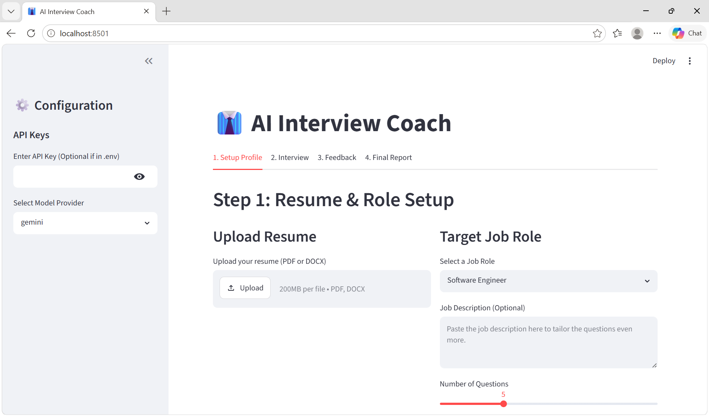

# 🎯 AI Interview Coach & Career Mentor

A stunning, full-stack **AI Interview Coach & Personalized Career Mentor** built with Python, Streamlit, LangChain, and powered by ultra-fast **Groq (Meta Llama 3.3 70B)**.

<div align="center">
  
</div>

---

## ✨ Key Features

### 1. 📄 Intelligent Resume & Role Tailoring
* **Resume Parsing:** Upload your resume in **PDF** or **DOCX** format; the app extracts key experience, skills, and achievements.
* **Role Customization:** Select from industry-standard roles or define custom roles alongside specific job descriptions to tailor every question to your exact target position.

### 2. 💡 Personalized AI Answer Coach (STAR Guidance)
* **On-the-Spot STAR Strategy:** During the mock interview, click **"✨ Generate Personalized STAR Talking Points"** under any question.
* **Resume-Driven Outline:** Automatically identifies the best project or role from your resume to highlight and structures a complete **Situation, Task, Action, and Result (STAR)** outline tailored to you.
* **Pro-Tips:** Provides insider keyword suggestions and delivery tips for each question.

### 3. 🤖 Interactive Prep Coach ('Coach Alex')
* **Dedicated Mentorship Chat:** Chat interactively with **Coach Alex**, your personal AI interview coach.
* **Context-Aware Advice:** Coach Alex remembers your resume and target job role to give hyper-personalized guidance on handling tough behavioral questions, explaining employment gaps, technical deep-dives, or salary negotiation.

### 4. 🎙️ Multi-Modal Mock Interview
* **Text & Voice Input:** Answer questions by typing or by speaking directly into your microphone with integrated audio recording & speech-to-text transcription.
* **Progress Tracking:** Seamlessly navigate through customized behavioral, technical, and situational questions.

### 5. 📊 Real-Time Multi-Metric Evaluation & Final Report
* **Granular Scoring:** Every answer is scored across **Overall, Relevance, Structure, Depth, and Communication** on a 1–10 scale.
* **Actionable Feedback:** Detailed constructive feedback explaining what went well and what to improve.
* **Final Report Summary:** An end-of-interview report card with aggregate performance metrics and recommendations.

### 6. 📱 Mobile-Friendly & Responsive UI
* **Touch-Optimized Controls:** Full-width touch buttons, compact tab navigation (`Setup`, `Interview`, `Coach`, `Feedback`, `Report`), and responsive padding for mobile & tablet viewports.
* **No iOS Safari Zoom:** Input font sizing optimized to prevent awkward zooming on mobile devices.

---

## 🛠️ Tech Stack & Architecture

* **Frontend:** Streamlit (Responsive UI, multi-step tab workflow, audio capture, chat interface)
* **AI & Orchestration:** LangChain Core (`langchain_core`)
* **LLM Engine:** Groq API running Meta's **`llama-3.3-70b-versatile`** model for lightning-fast inference
* **Document Processing:** PyPDF2 & `python-docx` for resume extraction
* **Audio Processing:** SpeechRecognition

---

## 🚀 Getting Started

### 1. Clone the Repository
```bash
git clone https://github.com/Arpit-mhjn1/ai-interview-coach.git
cd ai-interview-coach
```

### 2. Create a Virtual Environment
```bash
python -m venv venv
# On Windows:
venv\Scripts\activate
# On macOS/Linux:
source venv/bin/activate
```

### 3. Install Dependencies
```bash
pip install -r requirements.txt
```

### 4. Configure Your API Key
Add your Groq API key to Streamlit Secrets or your environment:

#### Option A: Streamlit Secrets (Recommended for Cloud Deployment)
In `.streamlit/secrets.toml` or Streamlit Cloud Dashboard Secrets:
```toml
GROQ_API_KEY = "gsk_your_groq_api_key_here"
```

#### Option B: Local Environment Variable
```bash
# On Windows PowerShell:
$env:GROQ_API_KEY="gsk_your_groq_api_key_here"

# On macOS/Linux:
export GROQ_API_KEY="gsk_your_groq_api_key_here"
```

### 5. Run the Application
```bash
streamlit run app.py
```

---

## 📖 Workflow Guide

1. **Step 1: Setup Profile** — Upload your resume and select your target job role.
2. **Step 2: Mock Interview** — Receive tailored interview questions. Use the **💡 Ask Your AI Coach** expander for instant STAR talking points before answering via text or voice.
3. **Step 3: 🤖 AI Prep Coach** — Ask Coach Alex any interview prep, salary negotiation, or resume strategy questions.
4. **Step 4: Instant Feedback** — Review your scores (1–10) and comprehensive feedback for each question.
5. **Step 5: Final Report** — Get your final overall performance evaluation and recommendations.

---

<div align="center">
  Built with ❤️ by <b>Arpit Website & App Studio</b>
</div>
